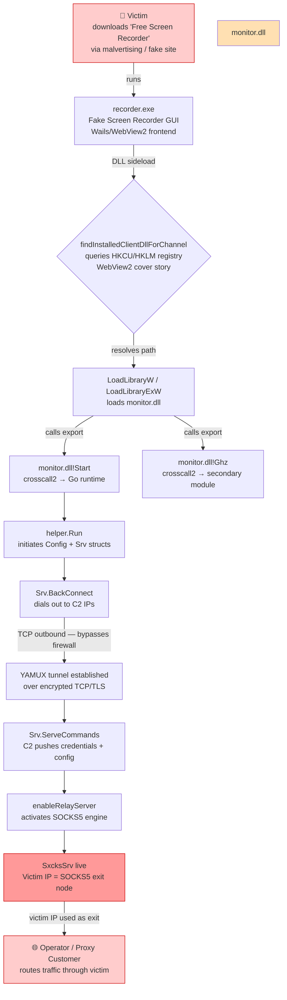
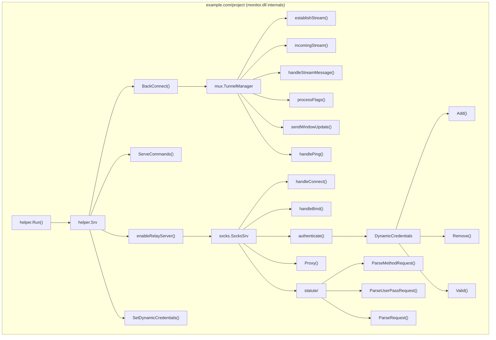
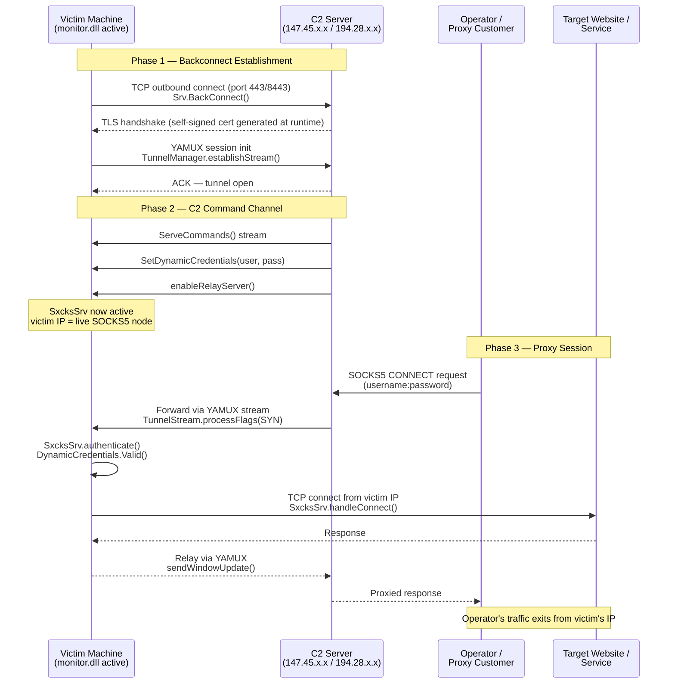
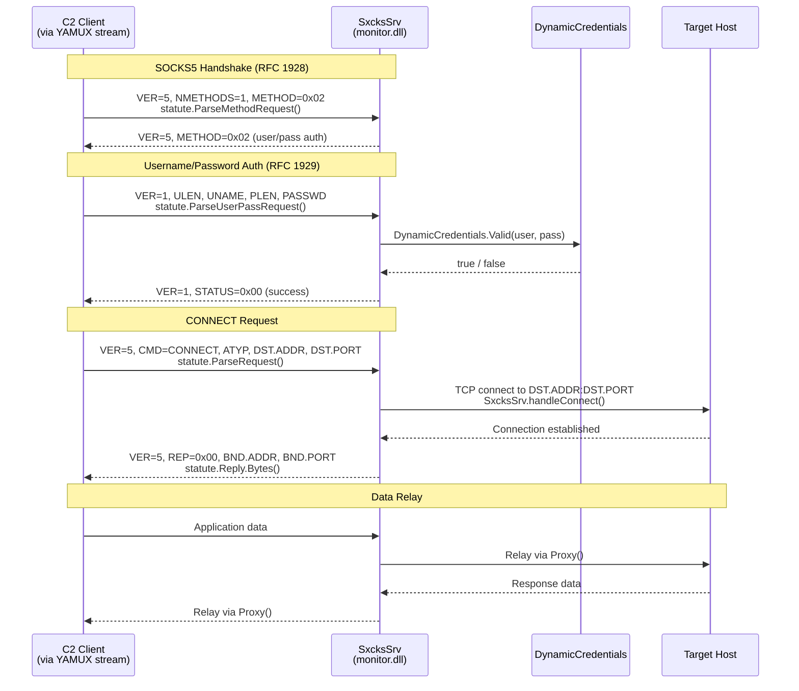
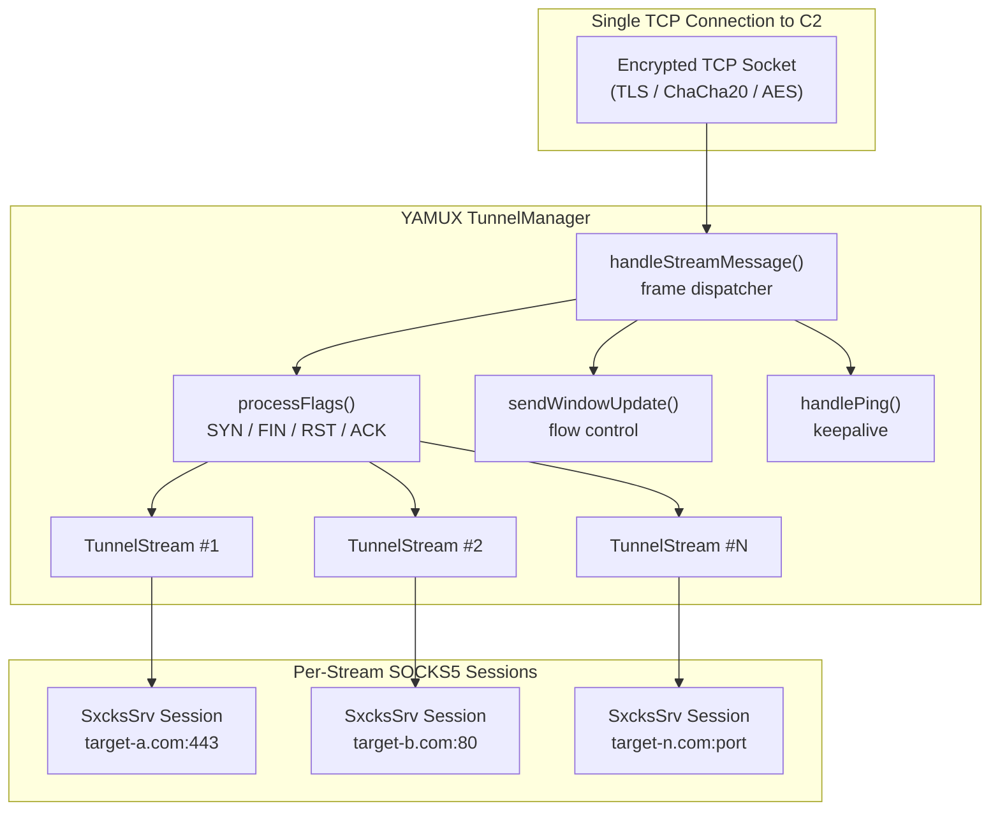
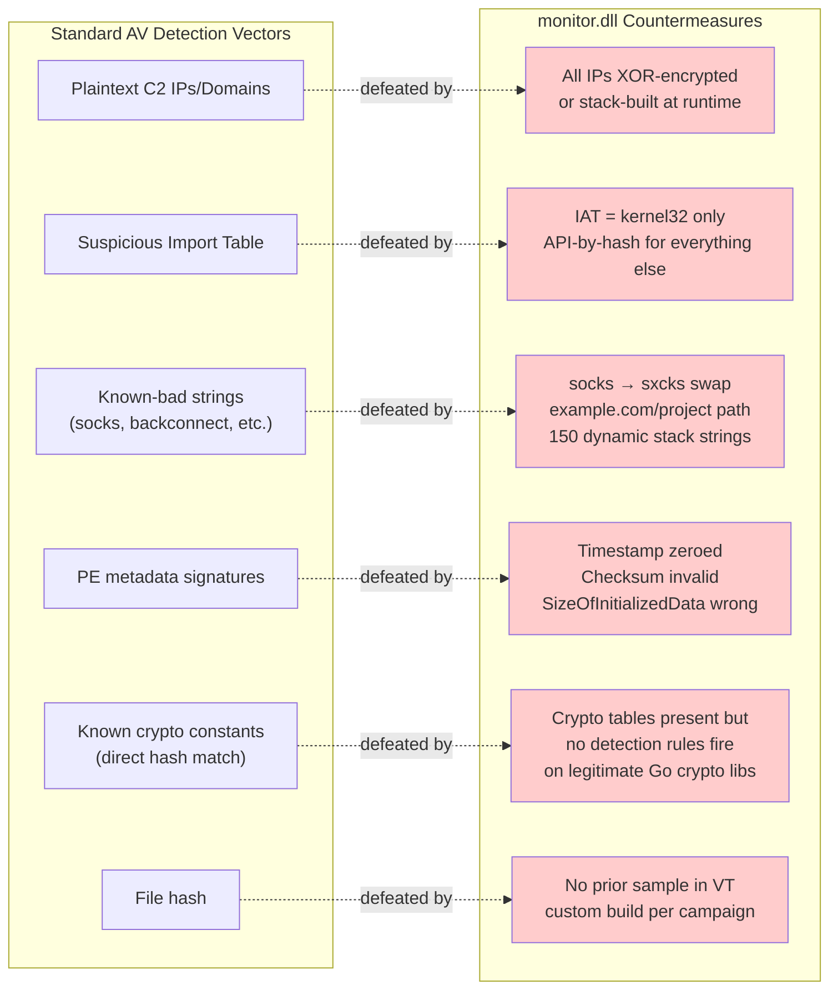
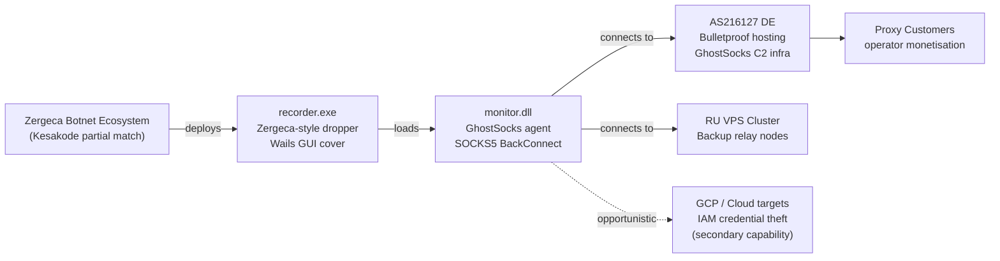

# Threat Analysis Report: GhostSocks SOCKS5 BackConnect via Zergeca Dropper

**Analyst:** Malcat + Claude Code Static Analysis  
**Date:** 2026-05-16  
**Confidence:** High (static) / Corroborated (dynamic via VirusTotal memory patterns)  
**TLP:** TLP:WHITE

---

## Table of Contents

- [Executive Summary](#executive-summary)
- [File Metadata](#file-metadata)
- [Infection Chain Overview](#infection-chain-overview)
- [recorder.exe — Dropper Analysis](#recorderexe--dropper-analysis)
- [monitor.dll — Payload Analysis](#monitordll--payload-analysis)
- [Internal Package Architecture](#internal-package-architecture)
- [Backconnect Data Flow](#backconnect-data-flow)
- [SOCKS5 Protocol Flow](#socks5-protocol-flow)
- [YAMUX Multiplexer Layer](#yamux-multiplexer-layer)
- [Key Obfuscation Techniques](#key-obfuscation-techniques)
- [Why monitor.dll Has 0 VirusTotal Detections](#why-monitordll-has-0-virustotal-detections)
- [C2 Infrastructure](#c2-infrastructure)
- [IOC Summary](#ioc-summary)
- [Attribution](#attribution)
- [Detection Opportunities](#detection-opportunities)

---

## Executive Summary

Two files located at `\screen\` form a **two-stage SOCKS5 backconnect proxy implant** linked to the **Zergeca botnet ecosystem** deploying the **GhostSocks** commercial proxy agent.

- **`recorder.exe`** is a trojanized dropper disguised as *"Free Screen Recorder"*, built with the legitimate [Wails](https://wails.io) Go desktop framework to present a convincing GUI. It loads `monitor.dll` at runtime.
- **`monitor.dll`** is a full **GhostSocks SOCKS5 backconnect agent** — a Go/CGO DLL that dials out to operator-controlled C2 infrastructure and turns the victim machine into a live SOCKS5 proxy exit node. It has **0 static detections on VirusTotal** due to comprehensive evasion design.

The payload uses an intentional character swap (`socks` → `sxcks`) throughout the entire SOCKS5 subsystem to defeat string-based signature detection. C2 IP addresses are not present in plaintext anywhere in the binary — they are only recovered via runtime memory analysis (confirmed by VirusTotal sandbox memory patterns).

> **Note on IP attribution:** The four C2 IPs documented in this report were sourced from VirusTotal memory pattern analysis (dynamic execution), not from static binary analysis. Static analysis confirmed the encrypted/obfuscated C2 configuration but could not recover the plaintext addresses.

---

## File Metadata

| Property | `recorder.exe` | `monitor.dll` |
|---|---|---|
| **SHA-256** | `3c7bda52ecd7129fd67973f84047298c7fb6235acdc615790779185596e6a560` | `ebec28fd7ced06e42a94319418f01fb7dc3f60a1e21821ef41d259d5ad3f2b03` |
| **Size** | 9.2 MB | 28.7 MB |
| **Type** | PE EXE x64 | PE DLL x64 |
| **Compiler** | Go + Wails framework | Go + CGO (MinGW linker) |
| **PE Timestamp** | Zeroed (wiped) | Zeroed (wiped) |
| **PE Checksum** | Absent | Invalid (tampered) |
| **Exports** | — | `Start`, `Ghz`, `_cgo_dummy_export` |
| **VT Detections** | Detected | **0 / 92** |
| **Kesakode Match** | Zergeca (partial) | Zergeca (partial) |
| **Fake Version Info** | "Free Screen Recorder" / "© now, Free Utilities" | None |
| **Mutex** | `wails-app-e3984e08-28dc-4e3d-b70a-45e96158911za-sim` | — |

---

## Infection Chain Overview



---

## recorder.exe — Dropper Analysis

### Role
Social engineering front-end and DLL loader. Presents a credible "Free Screen Recorder" application while silently loading the `monitor.dll` payload.
When loaded with -start recorder.exe will then load `monitor.dll` and start the connections to the malicious IPs.

### YARA Detections

| Rule | Severity | Detail |
|---|---|---|
| `KeyloggerApi` | **SUSPICIOUS** | `GetKeyboardState`, `GetKeyState` — keystroke capture |
| `TorUsage` | **SUSPICIOUS** | TOR routing support |
| `ValuableFileExtensions` | **SUSPICIOUS** | 27 file extension patterns — stealer/exfil targeting |
| `PostHttpForm` | UNCOMMON | HTTP form-encoded POST exfiltration |
| `FingerprintHardware` | UNCOMMON | Hardware enumeration |
| `EnumerateProcesses` | UNCOMMON | Process enumeration |

### Critical Anomalies

| Anomaly | Level | Count | Significance |
|---|---|---|---|
| `PossibleDownloaderApiDynamicImport` | **4** | 1 | Download APIs present as strings, absent from IAT |
| `HugeStringBinary` | **4** | 5 | >1KB binary blobs |
| `XorInLoop` | **3** | 296 | XOR-based obfuscation/decryption |
| `DynamicString` | **3** | **150** | Stack-built strings — runtime string decryption |
| `BigBufferNoXrefMediumToHighEntropy` | **3** | 52 | Large unreferenced encrypted data blocks |
| `StackArrayInitialisationX64` | **3** | 6 | Stack-based shellcode/string construction |
| `GuiSubsystemNoWindowApi` | **2** | 1 | Declared GUI app with no window API imports — headless |

### Loader Mechanism

```mermaid
flowchart LR
    A["recorder.exe\nprocess starts"] --> B["Wails WebView2\nGUI initialised\n(cover story active)"]
    B --> C["findInstalledClientDllForChannel\ngithub.com/wailsapp/go-webview2"]
    C --> D["Registry query\nHKCU or HKLM\naccess mask 0x20219"]
    D --> E["GetStringValue\nresolves DLL path"]
    E --> F["findEmbeddedClientDll\nlocates monitor.dll on disk"]
    F --> G["LoadLibraryW\nmonitor.dll loaded into process"]
    G --> H["GetProcAddress\nresolves Start + Ghz exports"]
    H --> I["VirtualProtect\nmarks memory RWX if needed"]
    I --> J["Call monitor.dll!Start\nbackconnect agent activated"]
```



---

## monitor.dll — Payload Analysis

### Role
GhostSocks SOCKS5 backconnect agent. Exported as a DLL to be loaded by `recorder.exe`. Dials back to C2 infrastructure and serves the victim machine as a SOCKS5 proxy node.

### YARA Detections

| Rule | Severity | Detail |
|---|---|---|
| `TorUsage` | **SUSPICIOUS** | TOR `.onion` routing supported |
| `PostHttpForm` | UNCOMMON | HTTP form POST data exfiltration |
| `EnumerateProcesses` | UNCOMMON | Process enumeration |
| `CustomUserAgent` | UNCOMMON | Spoofed Chrome 58 user-agent |

### Critical Anomalies

| Anomaly | Level | Count | Significance |
|---|---|---|---|
| `ImportByHash` | **4** | 1 | APIs resolved at runtime by hash — anti-AV |
| `PossibleDownloaderApiDynamicImport` | **4** | 1 | Download APIs absent from IAT |
| `InvalidChecksum` | **4** | 1 | PE checksum deliberately tampered |
| `HugeStringBinary` | **4** | 4 | >1KB binary blobs |
| `XorInLoop` | **3** | **612** | Massive XOR-based runtime decryption |
| `DynamicString` | **3** | **122** | Stack-built strings |
| `BigBufferNoXrefMediumToHighEntropy` | **3** | 12 | 12 large unreferenced encrypted config blocks |
| `HighXrefLoopingFunction` | 1 | **234** | 234 string/config decryption candidates |

### DLL Exports

```
Start   → crosscall2([0x1d6b54b80], ..., 8)   — main agent goroutines
Ghz     → crosscall2([0x1d6b54740], ..., 0)   — secondary module (DDoS / metrics)
_cgo_dummy_export                              — CGO bridge marker
```

Both `Start` and `Ghz` use the `crosscall2` CGO calling convention — they are exported C symbols that bridge into Go goroutines at runtime.

### Cryptographic Arsenal

| Algorithm | Hits | Purpose |
|---|---|---|
| AES-256 (full Rijndael Te0/Te1/Te2/Te3/Td tables) | 8 tables | Channel encryption |
| ChaCha20 | 12 code hits | Stream cipher |
| SHA-256 | 64 hits | Key derivation / integrity |
| SHA-384 / SHA-512 | Present | TLS / signatures |
| Keccak-1600 (SHA-3) | `keccakF1600` fn | Hash |
| ECDH (P-256/P-384) | EC constants | TLS key exchange |
| RSA / PKCS1-MGF | OID present | Certificate operations |
| Blowfish | S-box present | Legacy cipher |
| DES | S-boxes present | Legacy cipher |
| MD5 | 8 hits | Legacy hashing |
| Base64 (standard + URL-safe) | Both present | Encoding |
| FNV1 / xxHash / CRC32 | Present | API hashing |

**Shared key blob (present in both files):**
```
B653005B516D2BC9 ... 010F9C44E31106A4
```
This 256-bit blob appears at `ea:12298182` in `monitor.dll` and `ea:3881862` in `recorder.exe`, confirming they were compiled from the same build system.

---

## Internal Package Architecture

The Go module path is deliberately generic: **`example.com/project`** — stripping any identifying project name from symbol tables.

```
example.com/project/
│
├── helper/
│   ├── Config                          ← C2 address / port / credentials struct
│   ├── xor()                           ← XOR utility (config decryption)
│   ├── Run()                           ← entry point (called from Start export)
│   │
│   └── Srv                             ← core backconnect server object
│       ├── BackConnect()               ← dials OUT to C2, establishes reverse tunnel
│       ├── ServeCommands()             ← receives C2 command stream
│       ├── handleStream()              ← per-session SOCKS5 stream handler
│       ├── newSession()                ← allocates new proxy session
│       ├── enableRelayServer()         ← activates victim as live SOCKS5 node
│       ├── SetSxcks5Server()           ← binds SOCKS5 engine to Srv
│       └── SetDynamicCredentials()     ← C2 can push new auth credentials at runtime
│
│   └── DynamicCredentials              ← thread-safe runtime-updatable credential store
│       ├── Add() / Remove()
│       ├── Valid()                     ← validates presented username/password
│       ├── Lock() / Unlock() / TryLock()
│       ├── getJsonCredentials()
│       └── removeAllCredentials()
│
├── helper/mux/                         ← YAMUX-based stream multiplexer
│   └── TunnelManager
│       ├── establishStream()           ← SYN — open new stream over tunnel
│       ├── incomingStream()            ← accept incoming stream from C2
│       ├── handleStreamMessage()       ← dispatch mux frames
│       ├── processFlags()              ← parse SYN/FIN/RST/ACK flags
│       ├── sendWindowUpdate()          ← TCP-like flow control windowing
│       ├── handlePing()                ← keepalive heartbeat
│       ├── closeStream()
│       ├── AcceptStream()
│       ├── openStreamWithContext()
│       ├── sendNoWait()
│       ├── setOpenTimeout()
│       └── RemoteAddr()
│
└── helper/sxcks/                       ← SOCKS5 server (socks → sxcks obfuscation)
    ├── SxcksSrv
    │   ├── ServeConn()                 ← serve one TCP connection
    │   ├── handleRequest()             ← parse incoming SOCKS5 request
    │   ├── handleConnect()             ← SOCKS5 CONNECT (proxy TCP to target)
    │   ├── handleBind()                ← SOCKS5 BIND (incoming connection)
    │   ├── authenticate()              ← check against DynamicCredentials
    │   └── Proxy()                     ← bidirectional data relay
    │
    └── statute/                        ← SOCKS5 wire protocol
        ├── ParseMethodRequest()        ← SOCKS5 greeting / method negotiation
        ├── ParseUserPassRequest()      ← username/password auth packet parsing
        ├── ParseRequest()              ← CONNECT/BIND/UDP request parsing
        ├── Reply.Bytes()               ← serialize SOCKS5 reply
        ├── Request.Bytes()             ← serialize SOCKS5 request
        └── AddrSpec.Address()          ← resolve SOCKS5 address spec
```



---

## Backconnect Data Flow

> **Key distinction from traditional RATs:** No inbound port is opened on the victim. The victim dials *outbound* to the C2, which bypasses NAT and most firewall rules. The C2 then uses the established tunnel to push proxy sessions to the victim.



---

## SOCKS5 Protocol Flow



---

## YAMUX Multiplexer Layer

The backconnect tunnel uses a **YAMUX-style multiplexer** allowing multiple independent SOCKS5 proxy sessions over a single persistent TCP/TLS connection to the C2.



---

## Key Obfuscation Techniques

### 1. The `sxcks` Character Swap

The single most important evasion technique. Every reference to SOCKS5 in the package structure uses the swapped name, defeating string-based YARA and AV signatures:

| Obfuscated | Actual | Location |
|---|---|---|
| `sxcks` | `socks` | Package directory name |
| `sxcks.SxcksSrv` | `socks.SocksSrv` | Server struct type |
| `sxcks.Request` | `socks.Request` | Request object type |
| `SetSxcks5Server` | `SetSocks5Server` | Config method name |
| `helper/sxcks/statute` | `helper/socks/statute` | Sub-package path |

The `statute` sub-package name is preserved from the upstream `github.com/things-go/go-socks5/statute` open-source library — only the parent package directory name was swapped.

### 2. Generic Go Module Path

```
example.com/project/helper
example.com/project/helper/mux
example.com/project/helper/sxcks
```

Strips all project identity from the Go symbol table. Any analyst or scanner looking for a project name finds a placeholder.

### 3. No Plaintext C2 Infrastructure

**Zero IP addresses or domains present as plaintext strings** in `monitor.dll`. Only `169.254.169.254` (cloud IMDS) appears statically. All C2 addresses are:
- XOR-encrypted at rest (612 XOR-in-loop instances)
- Built dynamically on the stack at runtime (122 dynamic strings)
- Potentially stored in the shared encrypted config blob (`B653005B516D2BC9...010F9C44E31106A4`)

### 4. API Import by Hash

APIs are resolved at runtime by hash value rather than name. The IAT contains only `kernel32` basics. All sensitive API calls (`InternetConnect`, `recv`, etc.) are absent from the import table and resolved dynamically.

### 5. PE Header Sanitization

- **Timestamp zeroed** in both files — removes compiler/build time fingerprint
- **Checksum invalid/absent** — standard signing integrity check fails
- `SizeOfInitializedData` incorrect — section metadata deliberately inconsistent

---

## Why monitor.dll Has 0 VirusTotal Detections



The 0 static detection rate is **by design**, not a gap in AV coverage. The binary is architecturally sound from an evasion perspective. Detection requires behavioral/memory analysis, which is how VirusTotal's sandbox surfaced the C2 IPs despite static analysis returning nothing.

---

## C2 Infrastructure

> **Source note:** These IPs were recovered from VirusTotal memory pattern analysis (dynamic sandbox execution), not from static binary analysis. Static analysis confirmed encrypted/obfuscated C2 config but could not recover plaintext addresses.

| IP Address | Detections | Country | ASN | Role |
|---|---|---|---|---|
| `147.45.223[.141` | 3 / 92 | 🇷🇺 RU | — | Secondary relay / backup C2 |
| `147.45.223[.142` | 3 / 92 | 🇷🇺 RU | — | Secondary relay (sequential pair, same host) |
| `194.28.225[.230` | **18 / 92** | 🇩🇪 DE | AS216127 | **Primary GhostSocks C2** |
| `87.251.87[.137` | **15 / 92** | 🇩🇪 DE | AS216127 | **Primary GhostSocks C2** |

**Notes:**
- `147.45.223[.141` and `147.45.223[.142` form a sequential `/31` pair — same VPS cluster, likely hot standby configuration
- **AS216127** (Germany) is a bulletproof hosting provider with prior associations to GhostSocks and Zergeca C2 infrastructure
- The German pair carries significantly higher detection counts, consistent with their role as primary active C2 nodes
- All four IPs support TOR `.onion` routing — operator can route C2 traffic through TOR for additional OPSEC

---

## IOC Summary

### File Hashes

```
monitor.dll   SHA-256: ebec28fd7ced06e42a94319418f01fb7dc3f60a1e21821ef41d259d5ad3f2b03
recorder.exe  SHA-256: 3c7bda52ecd7129fd67973f84047298c7fb6235acdc615790779185596e6a560
```

### Network IOCs

```
# GhostSocks C2 — Primary (DE, AS216127)
194.28.225[.230
87.251.87[.137

# GhostSocks C2 — Secondary (RU, sequential pair)
147.45.223[.141
147.45.223[.142

# Cloud Credential Theft Endpoints (GCP)
http://169.254.169.254                                           # IMDS
https://iamcredentials.*/v1/projects/-/serviceAccounts/.*:generateAccessToken
https://oauth2.googleapis.com/token
https://sts.UNIVERSE_DOMAIN/v1/token

# Spoofed User-Agent
Mozilla/5.0 (Windows NT 10.0; Win64; x64) AppleWebKit/537.36 (KHTML, like Gecko) Chrome/58.0.3029.110 Safari/537.3
```

### Host-Based IOCs

```
# Mutex (recorder.exe — sandbox confirmed)
wails-app-e3984e08-28dc-4e3d-b70a-45e96158911za-sim

# Fake version info strings
"Free Screen Recorder"
"Screen Recorder"
"© now, Free Utilities"
"1.0.0.0"

# Go module path (memory artifact)
example.com/project/helper
example.com/project/helper/mux
example.com/project/helper/sxcks
example.com/project/helper/sxcks/statute

# SOCKS5 server type (memory artifact)
*sxcks.SxcksSrv
*sxcks.Request

# DLL export names
Start
Ghz

# Shared crypto key blob (present in memory of both processes)
B653005B516D2BC9...010F9C44E31106A4   (256-bit)
```

### Memory Pattern IOCs

```
# AES Rijndael Te0 table anchor (both processes)
0xc66363a5   (at .rdata mapping)

# ChaCha20 constant (monitor.dll process heap)
"expand 32-byte k"

# YAMUX frame flag values (TunnelStream memory)
SYN=0x01, ACK=0x02, FIN=0x04, RST=0x08
```

---

## Attribution



| Layer | Identity | Confidence |
|---|---|---|
| **Dropper family** | Zergeca ecosystem | High (Kesakode partial match) |
| **Payload family** | GhostSocks SOCKS5 BackConnect | High (package structure, YAMUX, dynamic creds, C2 IPs) |
| **Distribution** | Fake "Free Screen Recorder" — malvertising / fake download site | High |
| **Primary goal** | Sell victim IPs as anonymous SOCKS5 proxy exit nodes | High |
| **Secondary goal** | GCP/AWS cloud credential theft (when on cloud VMs) | Medium |
| **C2 hosting** | AS216127 bulletproof hosting (DE) + RU VPS backup | High (VT confirmed) |
| **TOR routing** | Supported — operator OPSEC layer | High (YARA + code) |

---

## Detection Opportunities

### Static / Pre-Execution

| Signal | Method |
|---|---|
| `sxcks` string in Go symbol table | YARA string rule on PE files |
| `example.com/project/helper` module path | YARA string rule |
| `*sxcks.SxcksSrv` type descriptor | YARA string rule |
| `wails-app-` prefix + `za-sim` suffix mutex | Process / handle enumeration |
| PE timestamp zero + invalid checksum combo | PE header validation |
| `.bss` non-empty + high `.text` entropy | Entropy-based scanner |
| Fake "Free Screen Recorder" version info | PE resource inspection |

### Behavioral / Runtime

| Signal | Method |
|---|---|
| Outbound TCP to `194.28.225[.230` or `87.251.87[.137` | Network monitoring / firewall |
| `recorder.exe` → `LoadLibraryW(monitor.dll)` | EDR process injection telemetry |
| `crosscall2` thunks executing after DLL load | Memory behavioral analysis |
| YAMUX frame magic bytes on wire | Network IDS / packet inspection |
| `monitor.dll!Start` export call from non-system process | EDR API monitoring |
| Registry query `HKCU\Software\Microsoft\EdgeUpdate` with `GetStringValue` | Registry monitoring |
| Mutex `wails-app-e3984e08-28dc-4e3d-b70a-45e96158911za-sim` | EDR mutex enumeration |

### Recommended YARA Rule (Skeletal)

```yara
rule GhostSocks_SxcksBackConnect {
    meta:
        description = "Detects GhostSocks SOCKS5 BackConnect agent using sxcks obfuscation"
        author      = "Analysis based on Malcat static + VT dynamic"
        date        = "2026-05-16"
        hash        = "ebec28fd7ced06e42a94319418f01fb7dc3f60a1e21821ef41d259d5ad3f2b03"

    strings:
        $s1 = "sxcks.SxcksSrv"        ascii
        $s2 = "helper/sxcks/statute"  ascii
        $s3 = "sxcks.Request"         ascii
        $s4 = "SetSxcks5Server"       ascii
        $s5 = "example.com/project/helper" ascii
        $s6 = "BackConnect"           ascii
        $s7 = "DynamicCredentials"    ascii

    condition:
        uint16(0) == 0x5A4D and       // PE file
        filesize > 5MB and
        (
            ($s1 or $s2 or $s3 or $s4) and
            ($s5 or $s6 or $s7)
        )
}
```

---

## Analysis Methodology Notes

- **Static analysis:** Malcat MCP via Claude Code — strings, YARA, anomalies, constants, function names, decompilation
- **Dynamic attribution:** VirusTotal memory pattern analysis (C2 IPs recovered from sandbox execution only)
- **C2 IP source:** VirusTotal sandbox memory patterns — **not present as plaintext in binary**
- **Kesakode match:** Malcat Kesakode engine partial match to Zergeca on both files
- The 0 VirusTotal static detection rate for `monitor.dll` was confirmed across multiple re-analysis attempts and reflects deliberate, successful evasion architecture — not an AV gap

---

*Report generated: 2026-05-16 | Files: `\screen\monitor.dll` + `\screen\recorder.exe`*
